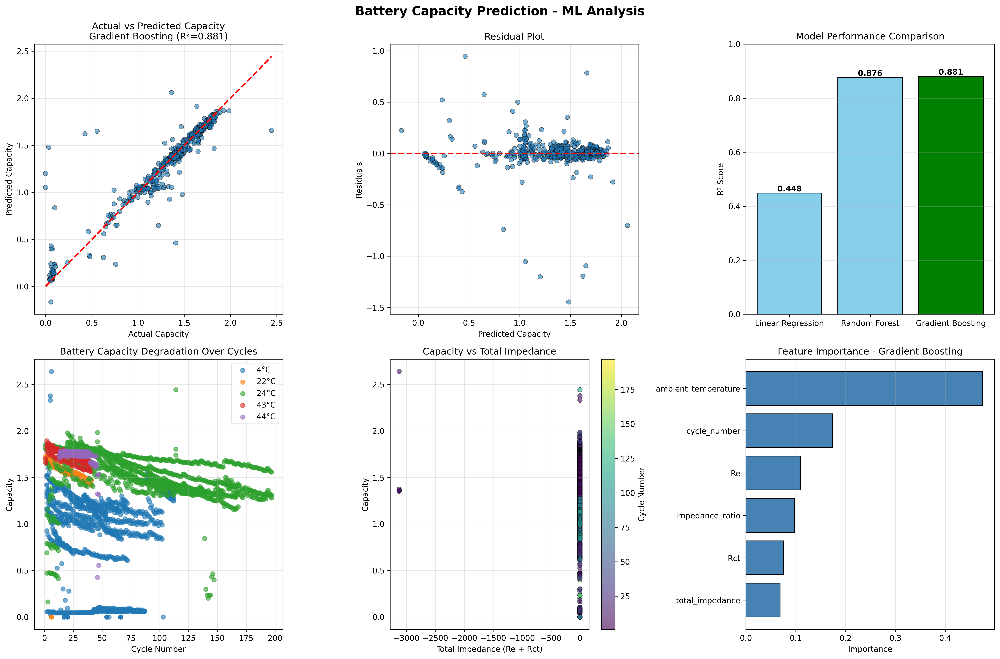

# battery_analysis
Analyzes battery data from NASA Li-ion battery dataset using Python to create 6 graphs that together determine the largest contributing factor to battery life cycle degradation. 

 
Plot 1: Actual vs Predicted capacity

The x-axis measures the battery capacity, while the y axis measures what the capacity was predicted to be by our machine learning model
The red dashed line is x=y, so points that lie on it or around it are successfully being captured by the model. The r squared score of 0.88 means that 88$ of the capacity variation is explained by the model—the capacity is successfully predicted by impedance, cycle number, and temperature. Since the data is fairly linear, there does not appear to be a bias.

Plot 2: Residual Plot (actual - predicted)

No clusters or patterns show that we do not have the wrong functional form or and model errors
Any outliers like those on the bottom may correspond with atypical aging of a cell, or a rare cycle

Plot 3: Model performance comparison by R squared

Gradient Boosting is the best model, which makes sense since capacitance degrades non linearly with respect to temperature, impedance, and cycle number

Plot 4: Battery Capacity Degradation over cycles:

Each point is a discharge cycle from a battery, they generally trend downwards because capacity decreases over repetition as the cycle ages. At temperatures of 43-44 degrees celsius, the degradation is much faster. This shows that higher temperatures negatively affect batteries. This fits with the idea that batteries perform worse in extreme temperatures, especially extreme heat. This is further confirmed in graph 6, which highlights that ambient temperature is the most important feature for gradient boosting.

Plot 5: Capacity vs Total Impedance:

The x-axis is the total impedance (electrolite resistance and charge transfer resistance), and the y-axis is capacitance. It shows that the higher the electrolyte resistance, the lower the usable capacity.

Plot 6: Feature importance:
The strongest predictor for aging is ambient temperature, which is much higher than anything else. 

To run it locally, Clone the repository, install dependencies with pip install -r requirements.txt, place metadata.csv in cleaned_dataset/data/, and run python battery_ml_analysis.py.

This code can be used with other data with light alterations, allowing it to help classify and improve Li-ion batteries based on testing.
